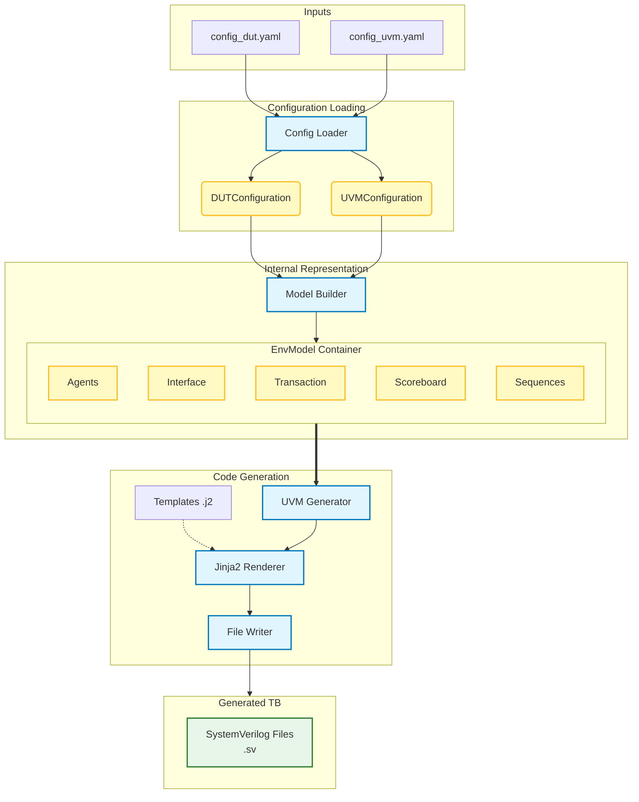

# UVM_PYGEN

## Architecture Representation

## User-Friendly Regeneration: Preservation of Manual Edits
UVM_PYGEN automatically preserves manual changes made by user. No special markers or protected areas are needed.