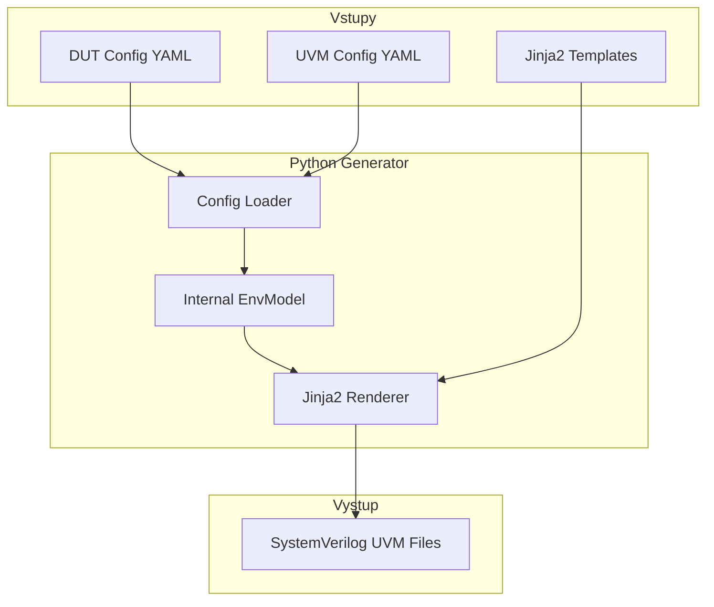
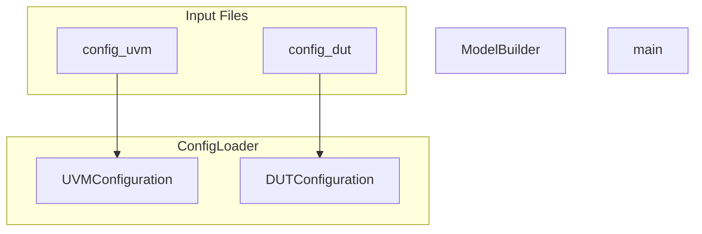
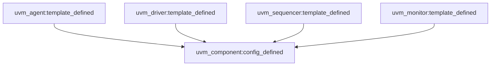
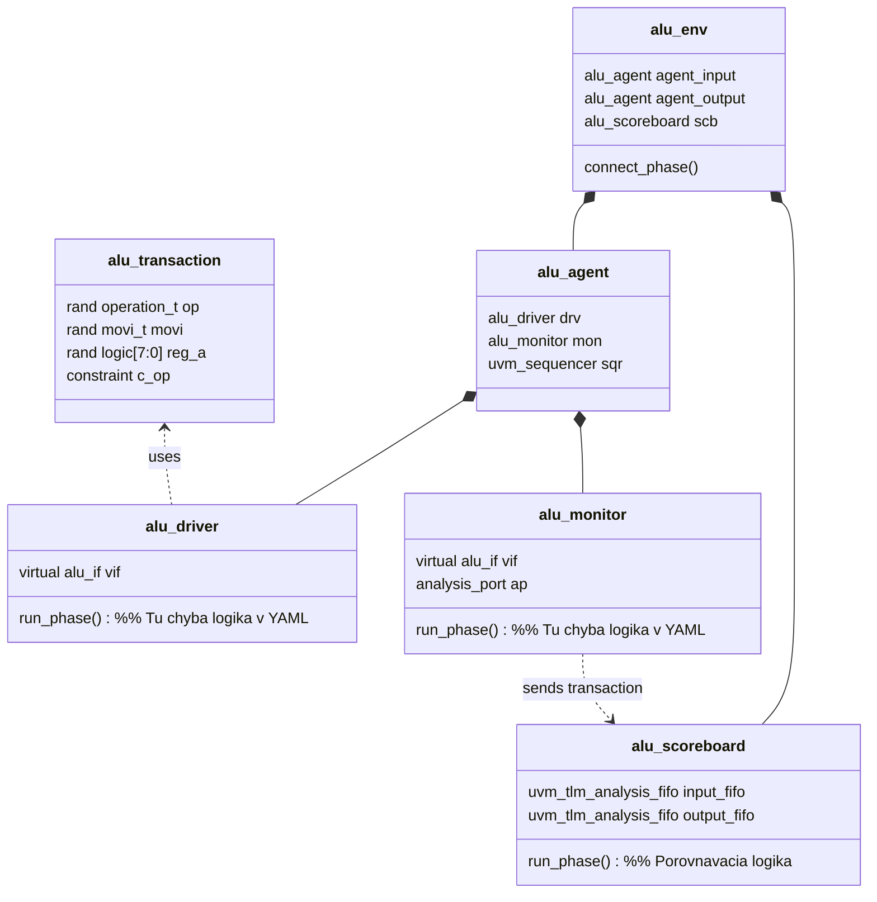
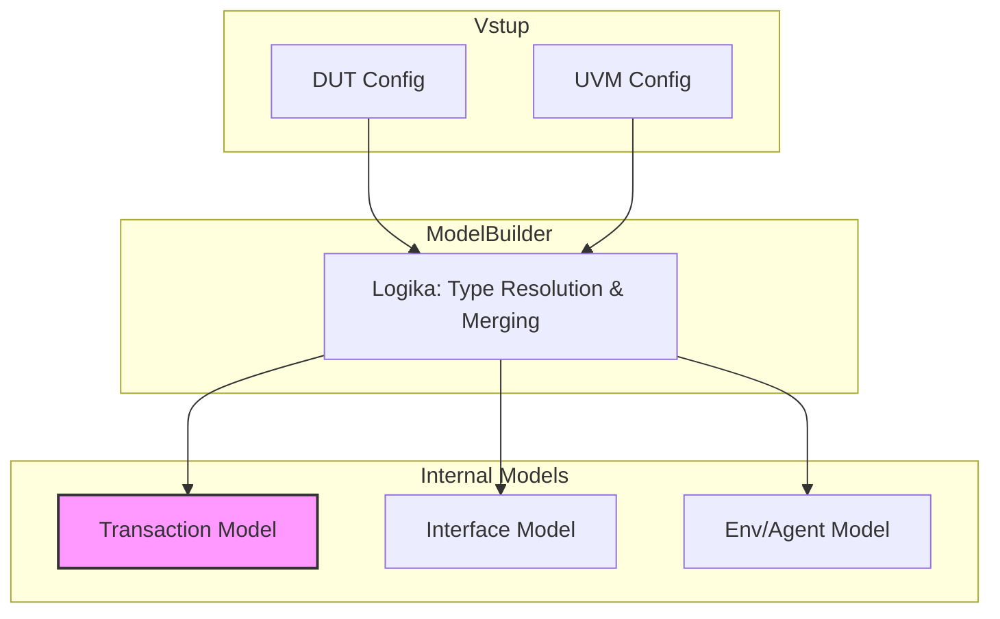

# UVM_PYGEN

## Jednoduchá reprezentácia



## Viac detailne



**Env -> Agent -> (Driver, Monitor, Sequencer)**

#### PyObjects representation



```
class EnvModel:
    agents: List[AgentModel]

    def __init__(self, name, agents):
        self.name = name
        self.agents = [Agent(a["name"], a["type"], a.get("active", True)) for a in agents]

class Agent:
    driver: DriverModel
    monitor: MonitorModel
    sequencer: SequencerModel

    def __init__(self, name, agent_type, active):
        self.name = name
        self.type = agent_type
        self.active = active
```

EnvModel
└── AgentModel (multiple)
├── InterfaceModel
├── DriverModel (optional - active agents only)
├── MonitorModel
├── SequencerModel (optional - active agents only)
└── CoverageModel (optional)




