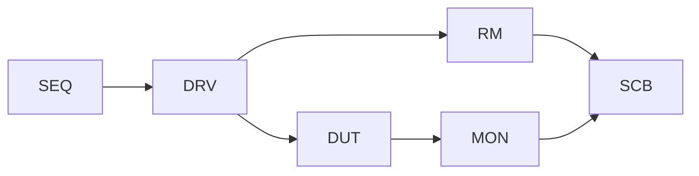
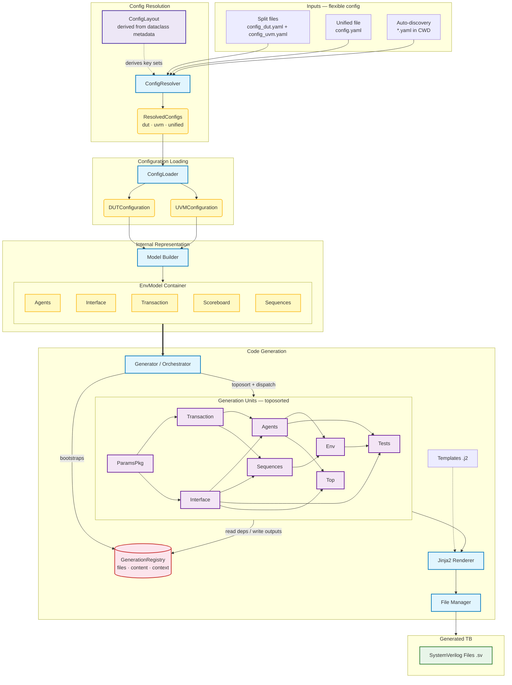

# UVM_PYGEN

**UVM_PYGEN** is a Python-based code generator that produces complete UVM (Universal Verification Methodology) testbenches in SystemVerilog from a YAML configuration file. It targets hardware verification engineers who want to eliminate UVM boilerplate and get a working, simulation-ready testbench from a description of the DUT and the desired verification architecture.

---

## Features

- **Single or split YAML configuration** — describe the DUT and the verification environment in one file or two separate files.
- **Full UVM environment generation** — parameters package, transaction, interface, agent (driver / sequencer / monitor), sequences, scoreboard, environment, tests, top module, and simulation scripts.
- **Agent topology** — one active agent (with driver, sequencer, monitor) and an arbitrary number of passive agents (monitor-only).
- **Automatic manual-edit preservation** — regeneration uses a 3-way merge so user edits survive without any special markers or protected regions.
- **Configuration caching** — resolved paths are cached so re-runs skip the discovery phase.
- **Parameterised generation** — port widths and types can reference DUT parameters.
- **Reference model** — AP subscriber strategy with SystemVerilog class implementation.


---

## Requirements

- Python **3.14+**
- [uv](https://github.com/astral-sh/uv) (recommended) or pip
- A SystemVerilog simulator (e.g. ModelSim / Questa) to run the generated testbench

---

## Installation

```bash
git clone https://github.com/stahlgit/uvm_pygen
cd uvm_pygen

# with uv (recommended)
uv sync

# or with pip
pip install -e .
```

---

## Quick Start

1. Copy or create a configuration file (see [Configuration](#configuration)).
2. Run the generator from the directory where you want the testbench files to be created:

```bash
# Unified config — both DUT and UVM sections in one file
python main.py --config config.yaml

# Split configs — DUT description and verification config in separate files
python main.py --dut-config config_dut.yaml --uvm-config config_uvm.yaml

# Auto-discovery — scans the current directory for *dut*.yaml / *uvm*.yaml
python main.py

# Re-use the previously resolved config paths (skip discovery)
python main.py --use-cache

# Recover from a cold start (missing or deleted cache) and regenerate
python main.py --reset --config config.yaml

# Verbose output
python main.py --config config.yaml --debug

# UV run
uv run .\main.py --config config.yaml
```

The generator writes SystemVerilog `.sv` files and TCL simulation scripts directly into the working directory.

---

## CLI Reference

| Flag | Description |
|---|---|
| `--config PATH` | Path to a unified configuration file (DUT + UVM sections combined) |
| `--dut-config PATH` | Path to a DUT-only configuration file |
| `--uvm-config PATH` | Path to a UVM-only configuration file |
| `--use-cache` | Skip config resolution and load paths from `.uvm_pygen/cache.json` |
| `--reset` | Re-seed the merge cache from the current output directory before generating (fixes cold-start) |
| `--debug` | Enable debug-level log output |

When no flags are given the tool auto-discovers YAML files in the current directory.

---

## Configuration

The generator accepts three input forms:

| Form | When to use |
|---|---|
| **Unified** (`--config config.yaml`) | Single file with both `dut:` and verification sections |
| **Split** (`--dut-config` + `--uvm-config`) | Two separate files for hardware and testbench concerns |
| **Auto-discovery** | Both files present in CWD following the `*dut*` / `*uvm*` naming convention |

### DUT section

```yaml
dut:
  name: alu                      # Used as prefix in generated file names
  entity_name: ALU_ENT           # Top-level HDL entity/module name
  description: "8-bit ALU"
  reset_type: active_high        # active_high | active_low
  language: systemverilog        # language specification - currently does nothing


params:
  - name: DATA_WIDTH
    value: 8
    description: "Data bus width"

enumerations:
  operation_t:
    type: "logic [3:0]"
    values:
      - { value: 0, name: ADD, description: "Addition" }
      - { value: 1, name: SUB, description: "Subtraction" }
      # ...

ports:
  - name: CLK
    direction: input
    type: logic
    width: 1
    is_clock: true
  - name: RST
    direction: input
    type: logic
    width: 1
    is_reset: true
    active_level: high
  - { name: OP, direction: input, type: logic, width: "(3:0)", enum_name: operation_t }
  - { name: DATA_IN, direction: input, type: logic, width: DATA_WIDTH }
  - { name: RESULT,  direction: output, type: logic, width: DATA_WIDTH }
```

Port fields:

| Field | Required | Description |
|---|---|---|
| `name` | yes | Signal name as it appears in the HDL |
| `direction` | yes | `input` or `output` |
| `type` | yes | HDL type (e.g. `logic`) |
| `width` | yes | Bit-width literal, expression, or parameter name |
| `is_clock` | no | Marks the clock signal |
| `is_reset` | no | Marks the reset signal |
| `active_level` | no | `high` or `low` (for reset ports) |
| `enum_name` | no | Associates the port with an enumeration type |
| `group` | no | Groups ports for interface assignment |
| `description` | no | Free-text description |

### Verification / UVM section

```yaml
verification:
  project_name: "ALU Functional Verification"
  testbench_name: "alu_testbench"

env:
  name: alu_env
  reference_model:
    strategy: ap_subscriber        # currently only ap_subscriber is implemented
    implementation: sv_class

    connects:
      - from: agent.driver.ap
        to: reference_model.analysis_export
        transaction: AluTransaction
      - from: agent.monitor.ap
        to: scoreboard.actual_export
        transaction: AluTransaction
      - from: reference_model.ap_expected
        to: scoreboard.expected_export
        transaction: AluTransaction

  interfaces:
    - name: AluInterface
      ports: ["Control Signals", OP, DATA_IN, RESULT]  # group name or individual port names

  agents:
    - name: agent
      mode: active               # active | passive
      interface: AluInterface
      transaction: AluTransaction
      components:
        - driver
        - sequencer
        - monitor

transactions:
  - name: AluTransaction
    field_overrides:
      - name: rst
        randomize: false
        default: 0
```

### Reference model

The currently implemented strategy is **AP Subscriber**. The active agent drives the DUT; the driver's analysis port feeds the reference model, which computes expected results and forwards them to the scoreboard. The monitor's analysis port feeds the scoreboard with actual results.


```mermaid
flowchart LR
    SEQ --> DRV --> RM
    DRV --> DUT
    RM --> SCB
    DUT --> MON
    MON --> SCB
```

> **Planned for future work:** dual-agent strategy (two independent agents, one for the reference path and one for the DUT) and a no-reference-model option. The corresponding enum values are already defined in the codebase.

---

## Generated Files

Running the generator produces the following files in the working directory:

| File | Description |
|---|---|
| `params_pkg.sv` | Parameters and enumeration type definitions |
| `<dut>_transaction.sv` | UVM sequence item with randomizable fields |
| `<dut>_interface.sv` | SystemVerilog interface with clocking blocks, drive and sample tasks |
| `<dut>_agent_pkg.sv` | Agent package (driver, sequencer, monitor) |
| `<dut>_sequences_pkg.sv` | Base, random, and derived sequence classes |
| `<dut>_env.sv` | Environment component that wires all sub-components |
| `<dut>_env_pkg.sv` | Environment package |
| `test_pkg.sv` | Base test and random test classes |
| `top.sv` | Top-level module that instantiates DUT and interface |
| `scoreboard.sv` | Scoreboard (actual vs. expected comparison) |
| `reference_model.sv` | Reference model (AP subscriber) |
| `coverage.sv` | Functional coverage collector |
| `sim.tcl` | ModelSim/Questa compilation and simulation script |
| `wave.tcl` | Waveform viewer configuration |

---

## Manual Edit Preservation

After the initial generation you can freely edit any generated file. When you re-run the generator (e.g. after updating the config), UVM_PYGEN performs a **3-way merge** between the previously generated version, the newly generated version, and your edited file. Changes you made are kept; parts regenerated from the template are updated. No special markers or protected regions are needed.

**Cold start (missing cache)** — if the output directory exists but the merge cache (`.uvm_pygen/`) has been deleted or was never created, the tool cannot safely merge and will skip the affected files to avoid overwriting your content. Run with `--reset` once to re-seed the cache from the current files on disk:

```bash
python main.py --reset --config config.yaml
```

This adopts the current file contents as the new merge base and then proceeds with normal generation.

---

## Examples

Three ready-to-use examples are provided in the [examples/](examples/) directory:

| File | DUT | Language | Notes |
|---|---|---|---|
| `config_single.yaml` | 8-bit ALU | SystemVerilog | Unified config, AP subscriber reference model |
| `config_timer.yaml` | Register-mapped timer | VHDL | 64-bit counter, interrupt output, multiple enumerations |
| `config_fifo.yaml` | FIFO with Hamming coding | VHDL | Parameterised depth, multiple status flags |

Run an example:

```bash
cd examples
python ../main.py --config config_single.yaml
```

> **Note:** the generated `top.sv` expects the DUT RTL to be present in an `rtl/` subdirectory relative to the working directory. Place your RTL sources there before compiling.


---

## Architecture


```mermaid
flowchart TD
    classDef logic    fill:#e1f5fe,stroke:#0277bd,stroke-width:2px;
    classDef data     fill:#fff9c4,stroke:#fbc02d,stroke-width:2px;
    classDef artifact fill:#e8f5e9,stroke:#2e7d32,stroke-width:2px;
    classDef registry fill:#fce4ec,stroke:#c62828,stroke-width:2px;
    classDef unit     fill:#f3e5f5,stroke:#6a1b9a,stroke-width:2px;
    classDef meta     fill:#ede7f6,stroke:#4527a0,stroke-width:2px;

    subgraph Inputs [Inputs — flexible config]
        direction TB
        SPLIT["Split files\nconfig_dut.yaml + config_uvm.yaml"]
        UNIFIED["Unified file\nconfig.yaml"]
        AUTO["Auto-discovery\n*.yaml in CWD"]
    end

    subgraph Phase0 [Config Resolution]
        Resolver[ConfigResolver]:::logic
        Layout[ConfigLayout\nderived from dataclass metadata]:::meta
        RC(ResolvedConfigs\ndut · uvm · unified):::data
        Layout -. derives key sets .-> Resolver
        Resolver --> RC
    end

    subgraph Phase1 [Configuration Loading]
        Loader[ConfigLoader]:::logic
        DUT_OBJ(DUTConfiguration):::data
        UVM_OBJ(UVMConfiguration):::data
    end

    subgraph Phase2 [Internal Representation]
        Builder[Model Builder]:::logic
        subgraph EnvModel [EnvModel Container]
            direction TB
            Ag[Agents]:::data
            If[Interface]:::data
            Tr[Transaction]:::data
            Sc[Scoreboard]:::data
            Seq[Sequences]:::data
        end
    end

    subgraph Phase3 [Code Generation]
        Generator[Generator / Orchestrator]:::logic
        Registry[(GenerationRegistry <br> files · content · context)]:::registry

        subgraph Units [Generation Units — toposorted]
            direction LR
            U1[ParamsPkg]:::unit
            U2[Transaction]:::unit
            U3[Interface]:::unit
            U4[Agents]:::unit
            U5[Sequences]:::unit
            U6[Env]:::unit
            U7[Tests]:::unit
            U8[Top]:::unit

            U1 --> U2 & U3
            U2 & U3 --> U4 & U5
            U4 & U5 --> U6
            U6 & U3 & U4 --> U7
            U3 & U4 --> U8
        end

        Renderer[Jinja2 Renderer]:::logic
        Writer[File Manager]:::logic
        Templates[Templates .j2]
    end

    subgraph Outputs [Generated TB]
        SV_FILES[SystemVerilog Files .sv]:::artifact
    end

    SPLIT & UNIFIED & AUTO --> Resolver
    RC --> Loader
    Loader --> DUT_OBJ & UVM_OBJ
    DUT_OBJ & UVM_OBJ --> Builder
    Builder --> EnvModel

    EnvModel ==> Generator
    Generator -- bootstraps --> Registry
    Generator -- toposort + dispatch --> Units
    Units -- read deps / write outputs --> Registry
    Units --> Renderer
    Templates -.-> Renderer
    Renderer --> Writer
    Writer --> Outputs
```
---

## Extending

The tool is designed to be extended without touching the generation pipeline itself.

**Adding a new configuration key**

Config schemas are Pydantic `BaseModel` classes in [uvm_pygen/models/config_schema/](uvm_pygen/models/config_schema/). Add a field to the relevant model (`dut_dataclass.py` for DUT keys, `uvm_dataclass.py` for verification keys) and `ConfigLayout` will pick it up automatically — it derives the full key set from model metadata at startup, so no registration step is needed.

**Adding a new generated file**

Each output file is produced by a generation unit in [uvm_pygen/models/generation/generation_unit/](uvm_pygen/models/generation/generation_unit/). Create a new unit class, declare its dependencies on other units, and register it in the generator. The topological sort handles compile-order automatically.

**Adding a new Jinja2 template**

Templates live in [uvm_pygen/templates/](uvm_pygen/templates/). Add a `.j2` file and reference it from the corresponding generation unit — the Jinja2 renderer resolves templates by path relative to that directory.

---

## Future Work

The following improvements are planned for future iterations:

- **Dual-agent reference model strategy** — two independent agents running in parallel, one driving the reference model and one driving the DUT, with both monitors feeding the scoreboard. The enum values and partial structures are already in place in the codebase.
- **No-reference-model option** — minimal testbench generation without a scoreboard or reference model, for early bring-up scenarios.
- **DPI-C extern reference model** — call a C/C++ function as the reference model via SystemVerilog DPI instead of a generated SV class.
- **Configurable RTL path** — currently the generated `top.sv` and simulation scripts assume the DUT sources live in a fixed `rtl/` subdirectory. A future iteration should allow specifying the RTL path (or paths) in the configuration file.
- **Multi-language DUT support** — explicit handling of mixed-language designs (e.g. VHDL DUT with SystemVerilog testbench), including correct compiler flags and compile-order generation in the TCL scripts.
- **Multi-interface and multi-transaction support** — the internal models already carry some groundwork; completing this would allow multiple active agents and per-agent transaction types in a single environment.
- **Virtual sequencer for multi-agent coordination** — a top-level sequencer that coordinates stimulus across multiple active agents.
- **Scoreboard with buffered out-of-order comparison** — the current scoreboard assumes in-order transaction matching; buffered comparison would support pipelined or out-of-order DUTs.
- **Merge conflict reporting** — when the 3-way merge cannot automatically reconcile a user edit with a regenerated section, surface a clear conflict report instead of silently picking one side.
