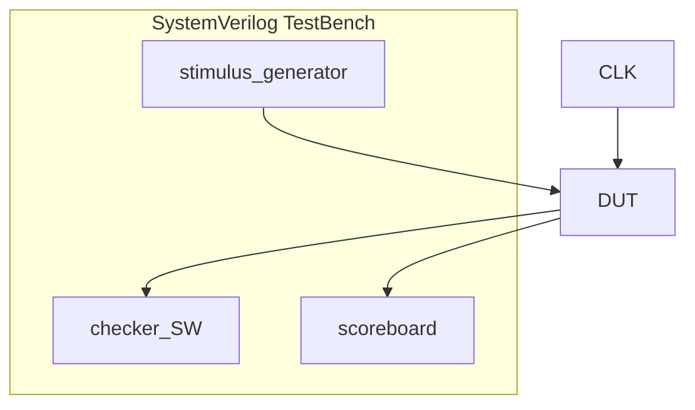
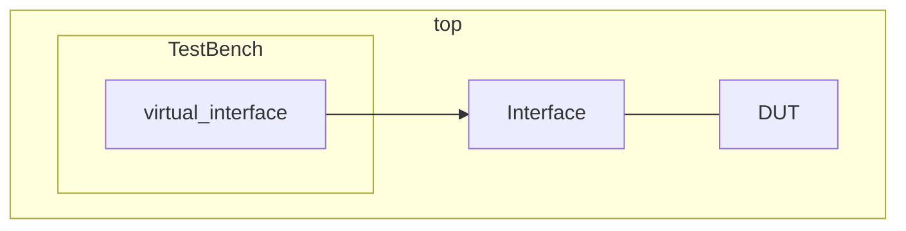

# 
so far only documentation here

### TestBench

### Simplified UVM hierarchy 
uvm_root
 ├─ uvm_component
 │   ├─ uvm_env
 │   ├─ uvm_test
 │   ├─ [uvm_agent](/docs/uvm_components/uvm_agent.md)
 │   │   ├─ uvm_driver
 │   │   ├─ uvm_sequencer
 │   │   └─ uvm_monitor
 │   ├─ uvm_scoreboard
 │   └─ uvm_subscriber
 │
 └─ uvm_object
     ├─ uvm_transaction
     │   └─ uvm_sequence_item
     │       └─ uvm_sequence
     ├─ uvm_config_db
     ├─ uvm_resource
     ├─ uvm_event
     ├─ uvm_factory
     └─ uvm_callback

 <b>uv_root</b> 

- 

    
uvm_component

    - 

        
uvm_env

      

    
    - 

        
uvm_test

        vytvára inštanciu UVM prostredia (uvm_env) a štartuje sekvenciu(uvm_sequence)
      

    
    - 

        
**uvm_agent**

        
        * 

            
uvm_driver

            driver
          

        * 

            
uvm_sequencer

            sequencer
          

        

    
    - 

        
uvm_scoreboard

      

    
    - 

        
uvm_subscriber

      

  

- 

    
uvm_object

    base for everything non-component
  

