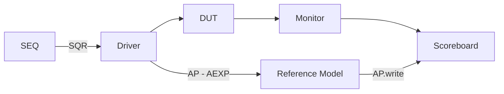
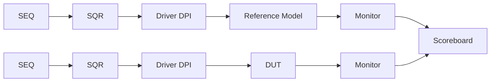

1. 
1.1 write(trans) AEXP
1.2 write aexp + AFIFO 
or something like that i dont know fully

```mermaid
flowchart LR
SEQ-->|SQR|Driver
Driver-->DUT
DUT-->Monitor
Monitor-->Scoreboard

Driver-->|AP - AEXP|REF[Reference Model]
REF-->|AP.write |Scoreboard
```

2. 

```mermaid
flowchart LR
SEQ1[SEQ]-->SQR1[SQR]-->
DR1[Driver DPI]-->RM[Reference Model]-->
MON[Monitor]-->Scoreboard

SEQ2[SEQ]-->SQR2[SQR]-->
DR2[Driver DPI]-->DUT-->
MON2[Monitor]-->Scoreboard
```

op.connect(scoreboard.fifo.analysis_export)